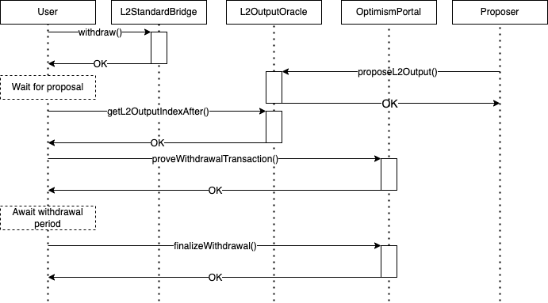

# opbnb-bridge-bot

## Description

The opbnb-bridge-bot project primarily maintains a Layer2 contract named `L2StandardBridgeBot`. This contract, when called, initiates withdrawal transactions and collects a fixed fee for every withdrawals. The project promises that after the withdrawal transaction has can be proven and finalized after the required time window, a third-party account would complete the corresponding L1 proven withdrawal transactions and L1 finalized withdrawal transactions, thus completing the entire withdrawal process.

## Motivation



A withdrawal request must be completed in three steps:

1. Send a L2 initiating transaction
2. Send the L1 proven transaction after the proposer submits the next L2 output root
3. Send L1 finalized transaction after the challenge window has passed

Completing these three steps might not be a good user experience. Firstly, users need to send 3 transactions; secondly, they need to wait 2 periods before sending the next transaction.

### See also

- opBNB testnet bridge: https://opbnb-testnet-bridge.bnbchain.org

- withdrawal example: https://testnet.opbnbscan.com/tx/0xadb6b8d8bffb4dc7177ef1e27e202035f0861a71521c3cdff66a4aeb4464e501

## Design Principle and Working Mechanism

This project consists of an on-chain contract [`contracts/src/L2StandardBridgeBot.sol`](contracts/src/L2StandardBridgeBot.sol) and [an off-chain bot](./cmd/bot/run.go#L67-L68).

The `L2StandardBridgeBot` contract provides a `withdrawTo` function, which charges a fixed fee for every execution and then forwards the call to the `L2StandardBridge.withdraw`.

The off-chain bot watches the `L2StandardBridgeBot.WithdrawTo` events and based on these events, re-constructs the corresponding withdrawals. We name these withdrawals as **bot-delegated withdrawals**. As time go out of the bot-delegated withdrawal's proven and finalized time window, our bot will send proven and finalized transactions to complete the entire withdrawal process.

references
- contracts
    - [L2StandardBridge.sol](https://github.com/bnb-chain/opbnb/blob/v0.2.2/packages/contracts-bedrock/contracts/L2/L2StandardBridge.sol#L105-L129) which concludes the `withdrawTo` function.
      - opBNB Mainnet [address](https://opbnbscan.com/address/0x4200000000000000000000000000000000000010).
      - opBNB Testnet [address](https://testnet.opbnbscan.com/address/0x4200000000000000000000000000000000000010)
    - [OptimismPortal.sol](https://github.com/bnb-chain/opbnb/blob/v0.2.2/packages/contracts-bedrock/contracts/L1/OptimismPortal.sol) which concludes the `proveWithdrawalTransaction` and `finalizeWithdrawalTransaction` functions.
      - BSC Mainnet [address](https://bscscan.com/address/0x1876EA7702C0ad0C6A2ae6036DE7733edfBca519).
      - BSC Testnet [address](https://testnet.bscscan.com/address/0x4386c8abf2009ac0c263462da568dd9d46e52a31)
- [opbnb bridge](https://opbnb-bridge.bnbchain.org)
- [tutorial](https://github.com/ethereum-optimism/optimism-tutorial/blob/main/cross-dom-bridge-erc20/README.md) of interacting with bridge with js-sdk.

## User Guide

### Getting Started at opBNB testnet

1. Prepare a MySQL database

```
docker-compose up -d
```

2. Compile the off-chain bot and output the artifact to `./bot`

```
make build-go
```

3. Run the off-chain bot

```
OPBNB_BRIDGE_BOT_PRIVKEY=<bot privkey> ./bot --config ./bot.toml
```

### Deploy and Use Contracts

1. Compile the contract using `forge`

```
make build-solidity
```

2. Deploy contract

```
cd contracts

export DELEGATE_FEE=1000000000000000
forge create \
    --rpc-url $OPBNB_TESTNET \
    --private-key $OP_DEPLOYER_PRIVKEY \
    src/L2StandardBridgeBot.sol:L2StandardBridgeBot --constructor-args $OP_DEPLOYER_ADDRESS $DELEGATE_FEE
```

3. Withdraw via the deployed contract

```
export DELEGATE_FEE=1000000000000000
export amount=2000000000000001
export contract_addr=<deployed contract address>

cast send --rpc-url $OPBNB_TESTNET \
          --private-key $OP_DEPLOYER_PRIVKEY \
          --value $(($DELEGATE_FEE + $amount)) \
          $contract_addr \
          $(cast calldata 'withdrawTo( address _l2Token, address _to, uint256 _amount, uint32 _minGasLimit, bytes calldata _extraData)' 0xDeadDeAddeAddEAddeadDEaDDEAdDeaDDeAD0000 $OP_DEPLOYER_ADDRESS $amount 150469 "")
```

## License

MIT
